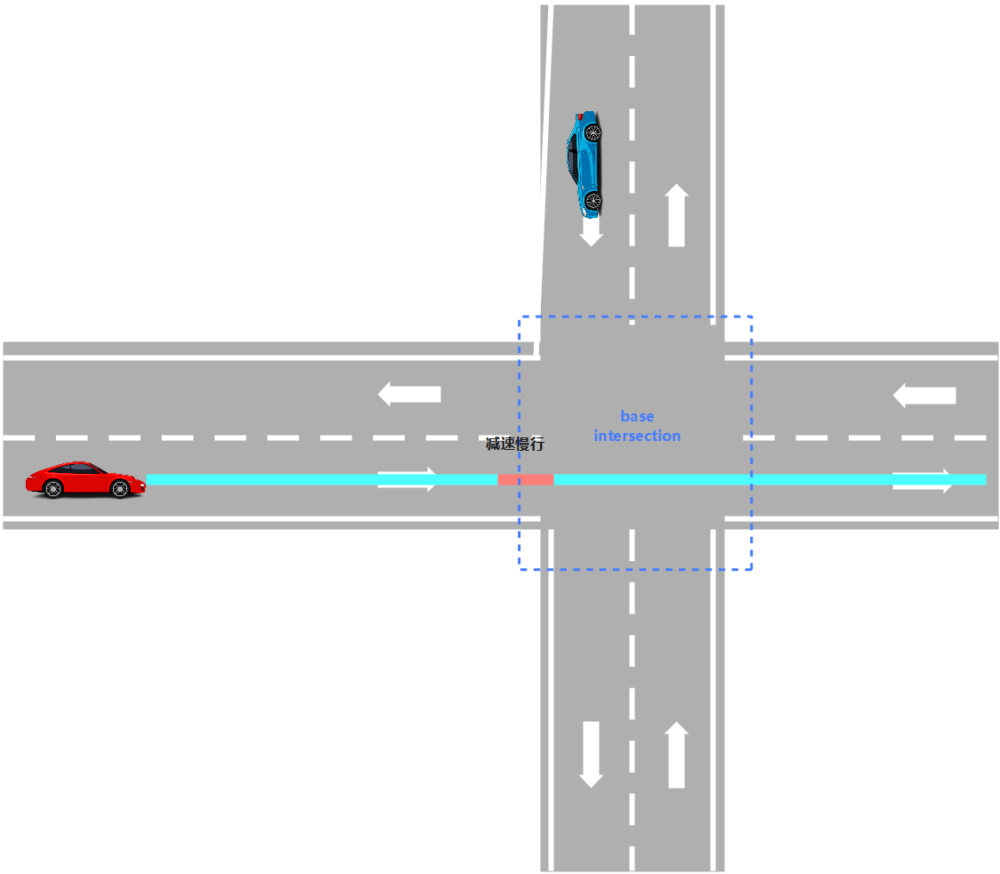

# 无保护简单十字路口
### 由 `swx-opentech` 研究并翻译！



## bare_intersection_unprotected_scenario.cc
### Init 函数
* 初始化状态检查：`if (init_) `检查场景是否已经初始化过，避免重复初始化。
* 基类初始化调用：调用父类 `Scenario::Init` 进行通用初始化。
* 加载特定配置：使用 `Scenario::LoadConfig` 加载当前场景特有的配置（如距离阈值等），存储在 `context_.scenario_config` 中。

---
### IsTransferable 函数
* 前置条件检查：检查规划命令是否为车道跟随`（lane_follow_command）`。
* 获取第一个重叠区域 `const auto& first_encountered_overlaps = reference_line_info.FirstEncounteredOverlaps();`
* 查找交通标志和 PNC 路口
  > `ReferenceLineInfo::SIGNAL` 信号灯 <br>
  > `ReferenceLineInfo::STOP_SIGN` 停止标志 <br>
  > `ReferenceLineInfo::YIELD_SIGN`  让行标志 <br>
  > `ReferenceLineInfo::PNC_JUNCTION` PNC 交叉路口
* 冲突处理
    ``` cpp
    static constexpr double kJunctionDelta = 10.0;   // 交通标志和 PNC 路口距离阈值
    double s_diff = std::fabs(traffic_sign_overlap->start_s - pnc_junction_overlap->start_s);
    if (s_diff >= kJunctionDelta) {
        if (pnc_junction_overlap->start_s > traffic_sign_overlap->start_s) {
            pnc_junction_overlap = nullptr;  // 放弃 pnc_junction_overlap
        } else {
            traffic_sign_overlap = nullptr;  // 放弃 traffic_sign_overlap
        }
    }
    ```
* 右侧行驶权检查
    ``` cpp
    if (reference_line_info.GetIntersectionRightofWayStatus(*pnc_junction_overlap)) return false;
    ```
    若车辆在交叉路口有通行权，则函数提前返回 false，表示不需要进一步处理让行逻辑。
* 距离判断
  > 检查自车到PNC路口的距离 `adc_distance_to_pnc_junction` 是否大于0且小于等于配置的距离阈值。
  >
  > 阈值由 `context_.scenario_config.start_bare_intersection_scenario_distance()` 提供。
  >
  > 若条件成立，则 `bare_junction_scenario` 为 `true` ，表示进入该场景。

---

### Enter 函数
  > 获取当前参考线上的首个相遇重叠区域 `first_encountered_overlaps`。
  >
  > 遍历这些重叠区域，查找类型为 `PNC_JUNCTION` 的对象。
  >
  > 若找到，则记录该路口的 `ID` 和起始位置`start_s`，并更新到上下文 `context_` 中。

---


## stage_approach.cc
这段代码是自动驾驶系统中处理无保护交叉路口接近阶段的逻辑，主要功能包括：

* **初始化与配置**：获取场景配置并执行参考线任务。
    ``` cpp
    scenario_config_.CopyFrom(GetContextAs<BareIntersectionUnprotectedContext>()->scenario_config);
    ```
* **判断是否通过停止线**：计算自车与交叉路口的距离，若已通过则结束当前阶段。
    ``` cpp
    if (distance_adc_to_pnc_junction < -kPassStopLineBuffer) {
    // passed stop line
    return FinishStage(frame);
    }
    ```
* **速度控制**：限制巡航速度以减速接近路口。
    ``` cpp
    frame->mutable_reference_line_info()->front().LimitCruiseSpeed(
    scenario_config_.approach_cruise_speed());
    ```
* **路权设置**：设置交叉路口的优先通行状态。
    ``` cpp
    reference_line_info.SetJunctionRightOfWay(current_pnc_junction->start_s,false);
    ```

* **障碍物检测与停车决策**：根据距离和障碍物情况决定是否停车，并构建停车决策。
    ``` cpp
    // 检查障碍物：调用 CheckClear 函数判断路径是否畅通，并获取需等待的障碍物ID列表
    bool clear = CheckClear(reference_line_info, &wait_for_obstacle_ids);
    // 距离在 [kStartWatchDistance, kCheckClearDistance] 范围内且路径不畅通时触发停车
    if (distance_adc_to_pnc_junction <= kCheckClearDistance &&
        distance_adc_to_pnc_junction >= kStartWatchDistance && !clear) {
    stop = true;
    } else if (distance_adc_to_pnc_junction < kStartWatchDistance) {
    // creeping area
    counter_ = clear ? counter_ + 1 : 0;

    // 若路径畅通则递增计数器，否则重置；计数器达到阈值后允许通行，否则继续停车。
    if (counter_ >= 5) {
        counter_ = 0;  // reset
    } else {
        stop = true;
        }
    }
    ```
---


