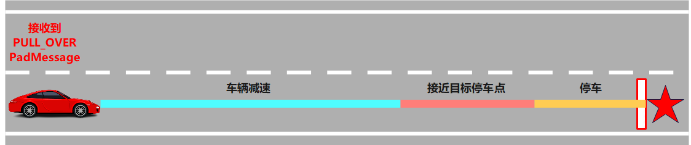

# 紧急靠边停车
### 由 `swx-opentech` 研究并翻译！


---
## stage_approach.cc
### Process 函数
* 获取场景上下文
* 设置车辆降速到目标速度并开启右转向灯
  > 获取参考线信息并限制巡航速度为目标减速速度
  >
  > 设置转向灯为右转 `reference_line_info.SetTurnSignal(VehicleSignal::TURN_RIGHT);`
  >
  > 计算停车线位置 （前置笛卡尔变换）
  ```cpp
    stop_line_s =
    pull_over_sl.s() + stop_distance + VehicleConfigHelper::GetConfig().vehicle_param().front_edge_to_center();
  ```
* 根据预设靠边位置创建虚拟障碍物作为停车边界
  > 创建虚拟障碍物 `const std::string virtual_obstacle_id = "EMERGENCY_PULL_OVER";`
  >
  > 决策应用到当前帧的参考线信息 ` planning::util::BuildStopDecision(...)`
* 执行路径规划任务
  > 规划任务 `StageResult result = ExecuteTaskOnReferenceLine(planning_init_point, frame);`
* 检测车辆是否在停车线附近且速度符合停止条件，满足时结束该阶段
  > 获取车辆一堆信息 `ADEBUG << "adc_speed[" << adc_speed << "] distance[" << distance << "]";`
  >
  > 当车速小于等于最大停车速度加上容差值，并且距离误差在允许范围内时，执行停车完成操作。
  ```cpp
  if (adc_speed <= max_adc_stop_speed + kStopSpeedTolerance &&
        std::fabs(distance) <= kStopDistanceTolerance) {
      return FinishStage();
    }
  ```
  >

---

## stage_slow_down.cc
### Process 函数
* 获取场景上下文  `auto scenario_context = GetContextAs<EmergencyPullOverContext>();`
* 获取并检查车辆当前速度
  > 获取车辆当前速度 `const double adc_speed = injector_->vehicle_state()->linear_velocity();`
  >
  > 检查车辆当前速度 `if (target_slow_down_speed <= 0) { ...}`
* 设置巡航速度限制为目标减速值 `reference_line_info.LimitCruiseSpeed(target_slow_down_speed);`
* 在参考线上执行规划任务 `StageResult result = ExecuteTaskOnReferenceLine(planning_init_point, frame);`
* 检测车辆是否减速到目标速度，满足时结束该阶段
  ``` cpp
    static constexpr double kSpeedTolarence = 1.0;
  if (adc_speed - target_slow_down_speed <= kSpeedTolarence) {
    return FinishStage();
  }
  ```
---
## stage_standby.cc
### Process 函数
* 获取场景上下文  `auto scenario_context = GetContextAs<EmergencyPullOverContext>();`
* 设置紧急灯信号并清除转向灯信号+限速
  > 设置危险报警灯 `reference_line_info.SetEmergencyLight();`
  >
  > 清除转向灯信号 `reference_line_info.SetTurnSignal(VehicleSignal::TURN_NONE);`
  >
  > 限速 `reference_line_info.LimitCruiseSpeed(FLAGS_default_cruise_speed);`
* 创建虚拟障碍物
  > 获取并检查停车位置的坐标有效性（x、y坐标是否存在）
  >
  > 笛卡尔坐标转经纬度坐标 `reference_line.XYToSL(pull_over_status.position(), &pull_over_sl);`
  >
  > 计算停止线位置 并 防止障碍物
  > 
  > 创建虚拟障碍物 `const std::string virtual_obstacle_id = "EMERGENCY_PULL_OVER";`
  >
  > 在指定位置设置停车线 
  ```cpp
  planning::util::BuildStopDecision(
        virtual_obstacle_id, stop_line_s, stop_distance,
        StopReasonCode::STOP_REASON_PULL_OVER, wait_for_obstacle_ids,
        "EMERGENCY_PULL_OVER-scenario", frame,
        &(frame->mutable_reference_line_info()->front()));
  ```
* 执行参考线上的规划任务 `StageResult result = ExecuteTaskOnReferenceLine(planning_init_point, frame);`
* 输出流程执行结果

### FinishStage 函数
该方法的功能是完成当前阶段，并通过调用FinishScenario()来结束整个场景。
  ```cpp
  StageResult EmergencyPullOverStageStandby::FinishStage() {
    return FinishScenario();
  }

  ```


