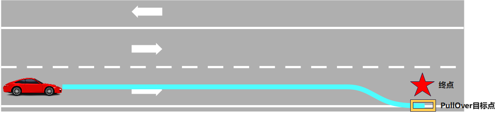

# 靠边停车
### 由 `swx-opentech` 研究并翻译！
`PullOverScenario`: 靠边停车场景


---
## stage_approach.cc
### Process 函数
* 检查场景
* 获取场景配置
* 执行参考线任务 `ExecuteTaskOnReferenceLine(planning_init_point, frame);`
* 获取参考线信息并检查靠边停车状态 `CheckADCPullOver`
    > 如果 `state` 为 `PASS_DESTINATION` 或 `PARK_COMPLETE`，完成场景，停车成功
    >
    > 如果 `state` 为 `PARK_FAIL`，停车失败
    >
    > 如果都不是，进入后续判断
* 提前检查 `path_data` 数据以尽早发现错误
    > 获取 `candidate_path_data` 候选路径
    >
    > 遍历 `candidate_path_data` 的每一个数据
    >
    > 检查字符串 `path_data.path_label()` 中是否不包含子串 `"pullover"` -> 跳出循环
    >
    > 从路径末尾开始向前遍历，确保检查靠近终点的路径点，跳过与终点距离小于 `min_distance_to_end` 的路径点
    >
    > 调用 `CheckADCPullOverPathPoint` 函数判断当前路径点是否满足靠边停车条件，若检测到 `PARK_FAIL` 状态，则标记路径失败
* 路径失败时
    > 获取靠边停车的位置信息
    >
    > 将车辆的目标停车位置从XY坐标系转换为SL坐标系
    >
    > 计算停车线的位置
    >
    > 构建一个停车决策 `planning::util::BuildStopDecision(...)`
    >
    > 判断车辆是否满足进入停车阶段的条件
* 设置 `StageStatusType::RUNNING`

### FinishStage 函数
* 接收一个布尔值 `success`，表示当前阶段是否成功
    > 如果 `success` 为 `true`，则退出当前阶段，并退出场景
    >
    > 如果 `success` 为 `false`，则退出当前阶段， 将下一阶段设置为 `"PULL_OVER_RETRY_APPROACH_PARKING"`

---

## stage_retry_approach_parking.cc
### Process 函数
* 检查场景not null
* 执行参考线上的任务
* 调用 `CheckADCStop(*frame)` 函数检查当前帧是否满足 `ADC` 停止条件
* 条件成立，结束当前阶段并返回其结果

### CheckADCStop 函数
* 获取车辆状态和参考线路信息
* 判断车辆是否在有效的停车位置
    > 若该距离超过配置的最大有效停车距离，则认为不是有效停车点

---

## stage_retry_parking.cc
### Process 函数
* 检查场景not null
* 设置当前轨迹为开放空间轨迹，调用 `ExecuteTaskOnOpenSpace` 函数执行开放空间规划任务
* 将泊车状态信息从规划上下文中复制到调试数据结构 （没啥用）
* 调用 `CheckADCPullOverOpenSpace()` 函数检查是否满足自动驾驶车辆靠边停车的条件
* `FinishStage`

## FinishStage 函数
结束场景

## CheckADCPullOverOpenSpace 函数
检查自动驾驶车辆是否成功到达指定的靠边停车目标位置

---
## pull_over_scenario.cc
### Init 函数
初始化场景配置

### IsTransferable 函数
* 获取参考线信息并坐标转换
* 检查目标点 `dest_sl` 是否在参考线 `reference_line` 的车道上
* 检查 当前只有一条参考线 + 车辆到终点的距离 `adc_distance_to_dest` 需在配置的最小缓冲距离
    > 若以上条件均满足，则 `pull_over_scenario` 为 `true`，触发靠边停车场景。
* 检查标志物或路口冲突
    > 获取当前参考线上的首个重叠区域信息（如路口、信号灯等） `frame.reference_line_info().front().FirstEncounteredOverlaps();`
    >
    > 遍历重叠区域信息，检查其类型是否为路口、信号灯、停车标志或让行标志
    >
    > 计算目标点到重叠区域的距离以及已通过的距离
    ```cpp
    const double distance_to = overlap.second.start_s - dest_sl.s();
    const double distance_passed = dest_sl.s() - overlap.second.end_s;
    ```
    >
    > 若任一距离小于阈值 `kDistanceToAvoidJunction` ，则取消靠边停车场景 `pull_over_scenario = false;`
* 检查自动驾驶车辆在靠边停车场景
    > 获取当前参考线信息并坐标转换从车辆前端位置开始，每隔 `kDistanceUnit` 米检查一次车道信息 -> ` check_s += kDistanceUnit;`
    >
    > 根据给定的路径长度 `check_s` 获取对应的车道信息 -> `reference_line.GetLaneFromS(check_s, &lanes);`
    >
    > 检查当前车道右侧前方相邻车道是否适合停车 遍历 -> `for (const auto& neighbor_lane_id : lane->lane().right_neighbor_forward_lane_id())`
    >
    > 获取指定ID的邻近车道信息 `const auto neighbor_lane = hdmap_ptr->GetLaneById(neighbor_lane_id);`
    >
    > 检查当前车道右侧相邻车道的类型是否为城市驾驶车道（`CITY_DRIVING`）
    ```cpp
    const auto& lane_type = neighbor_lane->lane().type();
        if (lane_type == hdmap::Lane::CITY_DRIVING) {
            ...
            rightmost_driving_lane = false;
            break;
        }
    ```
    >
    > 不适合向右停车 -> 设置 `pull_over_scenario = false;`
